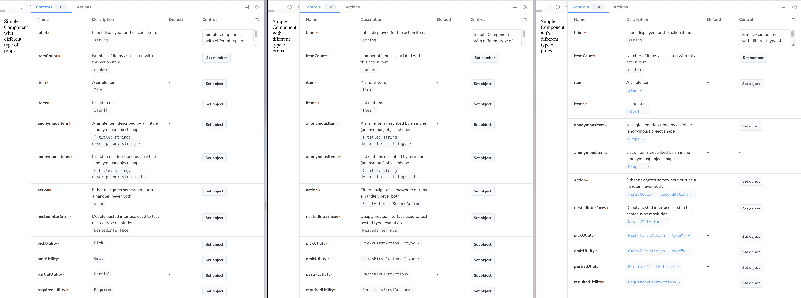
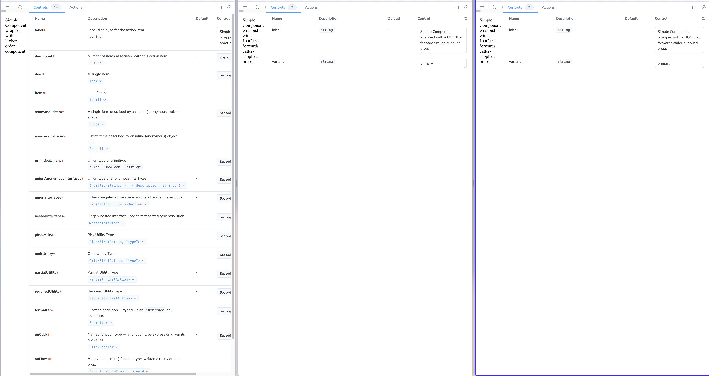

# react-docgen-pro

It's a typescript-aware props parser for React projects, built on the Typescript compiler API.

## Motivation

Storybook works fine with React and Typescript, but once the types get complex, ArgTable can't parse them fully. A few issues I ran into were:

- jsdoc for props not showing up in Storybook at all
- some types described as a union instead of the interface name
- an interface name shown, but no way to see the actual structure of the type
- with union types, jsdocs disappearing entirely (the value itself comes through, but if a prop is optional, consumers have no way of seeing that)

It becomes a bigger issue when consumers need to see the props and end up having to open a code editor and go find the type definition in the library themselves.

While digging into this, I realized Storybook actually uses two different parsers under the hood — `react-docgen` and `react-docgen-typescript`.

They work fine up to a point, but often you hit a wall, need to start overriding argTypes by hand, and end up with two sources of truth (the type files and Storybook itself).

To fix this, I decided to use Claude Code and try writing my own parser to see if it could be solved properly.

That's how this journey started.

## Comparison with react-docgen and react-docgen-typescript

| Feature | react-docgen | react-docgen-typescript | react-docgen-pro |
| ----- | ----- | ----- | ----- |
| Primitive properties | renders type | renders type | renders type |
| Named interface | renders only name of interface (unable to see the structure) | renders only name of interface (unable to see the structure) | renders name of interface, clickable to see the structure of the interface |
| Array of named interface | same limitation as previous one | same limitation as previous one | works the same as previous one |
| Anonymous interface | renders structure of interface as text | renders structure of interface as text | renders clickable Props interface, click to see the structure |
| Array of anonymous interfaces | same limitation as previous one | same limitation as previous one | works the same as previous one |
| Union primitives | renders 'union' keyword | renders name of each type | renders name of each type |
| Union interfaces | renders 'union' keyword | renders name of interfaces | renders clickable names of interfaces, click to see the type of each |
| Nested interfaces | shows only name of interface | shows only name of interface | clickable name of interface, click to see the structure |
| Utility functions (Pick, Omit, Partial, Required) | renders name of utility function ('Pick', 'Omit', etc.) | renders the definition, e.g. `Pick<FirstAction, "type">` | renders clickable definition, click to see the structure |
| Function with interface call signature | renders only name of the interface | renders only name of the interface | renders name of the interface with popup to show arguments and return type | 
| Named function type | renders string with arguments and return type | renders string with arguments and return type | renders name of interface, with popup to show function arguments and return type | 
| Anonymous function | renders string with arguments and return type | renders string with arguments and return type | renders clickable string to show detailed type | 
| Anonymous function with interface argument | renders string with name of interface | renders string with name of interface | renders clickable string with popup to show structure of interface | 
| forwardRef | same output with above mentioned details | same output with above mentioned details | same output with above mentioned details |
| HOC | x | x | x |

Here is the visual version of comparison of these 3 tools (from left to right: react-docgen, react-docgen-typescript, react-docgen-pro):

Basic Component:



With HOC:



## Quick start

Most people use this through the Vite or webpack integration below to get
Storybook's Controls panel working properly — jump to whichever builder you
use. If you just want the parsed props as JSON, call `parse()` directly:

## Using it with Storybook + Vite

```bash
npm install --save-dev react-docgen-pro
```

In `.storybook/main.ts`:

```ts
import type { StorybookConfig } from '@storybook/react-vite';
import { viteLoader } from 'react-docgen-pro/vite';

const config: StorybookConfig = {
  framework: '@storybook/react-vite',
  addons: [
    '@storybook/addon-essentials',
    // Registers a Storybook argTypesEnhancer that hides Controls fields
    // from non-active union branches and fills in branch-specific
    // descriptions — runs automatically for every story.
    'react-docgen-pro/vite/preset',
  ],
  typescript: {
    // Turn off Storybook's built-in docgen — react-docgen-pro supplies
    // __docgenInfo itself via the plugin below.
    reactDocgen: false,
  },
  async viteFinal(viteConfig) {
    viteConfig.plugins ??= [];
    // Pass options to viteLoader() to configure parsing, e.g. raise
    // (or Infinity to disable) the 50-char default cap on rendered
    // type-name strings like `Pick<Foo, "a" | "b" | ...>`.
    viteConfig.plugins.push(viteLoader({ maxTypeNameLength: 80 }));
    return viteConfig;
  },
};

export default config;
```

## Using it with Storybook + webpack

```bash
npm install --save-dev react-docgen-pro
```

In `.storybook/main.ts`:

```ts
import type { StorybookConfig } from '@storybook/react-webpack5';

const config: StorybookConfig = {
  framework: '@storybook/react-webpack5',
  addons: [
    '@storybook/addon-essentials',
    // Same preset used by the Vite setup — it's builder-agnostic.
    'react-docgen-pro/vite/preset',
  ],
  typescript: {
    reactDocgen: false,
  },
  webpackFinal: async (webpackConfig) => {
    webpackConfig.module ??= { rules: [] };
    webpackConfig.module.rules ??= [];
    webpackConfig.module.rules.push({
      test: /\.tsx$/,
      exclude: /node_modules/,
      enforce: 'pre',
      // `options` here is react-docgen-pro's own ParseOptions, forwarded
      // to every parse() call — same fields as the Vite loader above.
      use: [{ loader: 'react-docgen-pro/webpack', options: { maxTypeNameLength: 80 } }],
    });
    return webpackConfig;
  },
};

export default config;
```

Either way, once wired in, every exported component in a `.tsx` file gets a
`Component.__docgenInfo` static property attached at build time — the same
convention `react-docgen-typescript`-based tooling already reads — so
Storybook's addon-docs and Controls panel pick it up with no other changes.

## Configuration

Both `viteLoader(options)` and the webpack loader's rule `options` take the
same `ParseOptions` object accepted by `parse()` directly:

| Option              | Default | What it does                                                                                     |
| -------------------- | ------- | -------------------------------------------------------------------------------------------------- |
| `maxTypeNameLength`  | `50`    | Caps a rendered type-name string (a prop's type, a union branch, a fallback displayName) at N characters, truncating with `…`. Set to `Infinity` to disable. |
| `maxDepth`           | `2`     | How many levels of nested object props get expanded into `type.properties`.                         |

```ts
import { parse } from 'react-docgen-pro';

const doc = parse('./Button.tsx', { maxTypeNameLength: 80 });
```
